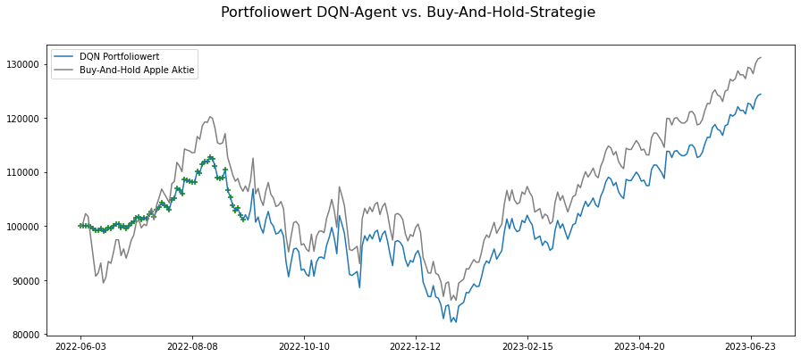
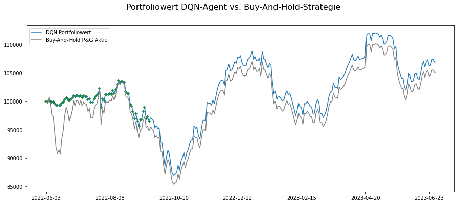

# Reinforcement Learning Project - Semester 6
This repository contains the code and resources for the reinforcement learning project undertaken during Semester 6 as part of the course on reinforcement learning. 
The project focuses on developing and implementing a Deep Q-Network (DQN) agent to make trading decisions in a stock market environment.

## Project Structure
The project is organized into several folders and files, each serving a specific purpose:

1. **agent/:** This folder contains the implementation of the Deep Q-Network (DQN) agent. The DQN is a popular algorithm for reinforcement learning, especially in scenarios where the state and action spaces are large and continuous.
2. **data/:** This folder includes the necessary files and a Jupyter Notebook for downloading stock data. The data is essential for training and evaluating the DQN agent's performance in the trading environment.
3. **environment/:** Here, you will find the implementation of the trading environment, which provides a simulated market where the DQN agent can learn to make trading decisions based on the provided data.
4. **models/:** This folder will store the trained DQN models' weights after the training process is complete. Saving the trained models allows easy access for evaluation and future use.
5. **evaluation.ipynb:** This Jupyter Notebook is used to evaluate the performance of the trained DQN agent. It will load the saved models and run them in the trading environment to measure their effectiveness.
6. **training.ipynb:** This Jupyter Notebook is dedicated to training the DQN agent. The notebook will utilize the trading environment and historical stock data to train the agent to make profitable trading decisions.

## Getting Started

To get started with the project, follow these steps:

1. Clone the repository to your local machine:
````
git clone https://github.com/dschmtz/reinforcement-learning-semester6.git
cd reinforcement-learning-semester6
````

2. Install the required dependencies. It's recommended to set up a virtual environment to avoid conflicts:
````
python -m venv venv
source venv/bin/activate   # On Windows, use: venv\Scripts\activate
pip install -r requirements.txt
````

3. Download the stock data by running the provided Jupyter Notebook in the data folder. The notebook will handle the data downloading, ensuring the data is ready for training and evaluation.

4. Train the DQN agent by executing the training Jupyter Notebook. This notebook will use the historical stock data and the trading environment to train the agent.

5. Evaluate the trained agent by running the evaluation Jupyter Notebook. The evaluation notebook will load the trained agent's weights from the models folder and test it in the trading environment to assess its performance.

## Results
During the exploration phase, the agent tried to sell, but as the training progressed, the number of sales decreased with each episode. 
The results show that the agent is learning a buy-and-hold strategy.



The RL-Agent manages its portfolio by continuously buying stocks with a limited budget, holding stocks without selling. The graph shows the points where stocks were bought, indicating that the RL-Agent also follows a Buy-And-Hold strategy, continuously purchasing stocks until the initial capital of $100,000 is fully invested. No sales are shown in the graph as none were executed. The RL-Agent, using continuous purchases, cannot outperform the Buy-And-Hold strategy for Apple stock, lagging behind by approximately 6%.



Furthermore, the same strategy is observed for Procter & Gamble stock in the second figure. The RL-Agent again buys as many stocks as possible in the initial days until the initial capital is depleted. In this case, the RL-Agent even outperforms the traditional Buy-And-Hold strategy as it was able to buy stocks at lower prices at a later time.

## Conclusion
In conclusion, the RL-Agent was able to maximize its reward by not opting for stock sales during the training process. However, it remains uncertain whether making stock purchase decisions solely based on the stock price can lead to truly sensible choices. The initial research hypothesis must be discarded since the decisions made, resembling a Buy-And-Hold strategy, follow more of an intuitive approach. To make meaningful investment decisions, it is necessary to forecast the stock price, which is not deterministic due to its stochastic nature and the multitude of influencing variables. Future research should consider incorporating additional variables, such as sentiment analysis of news reporting, alongside the stock price to improve decision-making.
